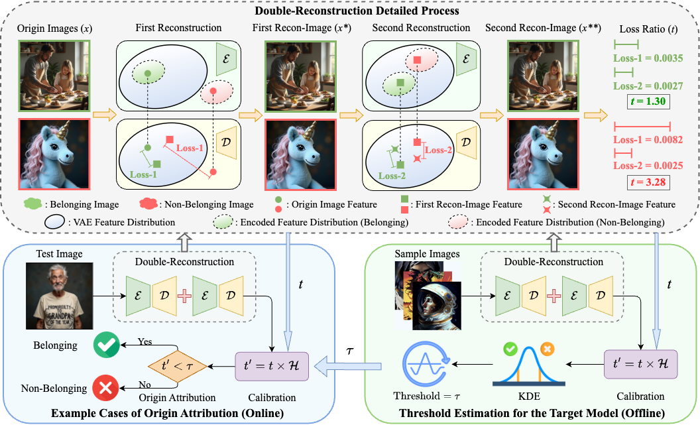

# AEDR: Training-Free AI-Generated Image Attribution via Autoencoder Double-Reconstruction (AAAI-2026-Oral)

[](https://arxiv.org/pdf/2507.18988)

This repository hosts the official PyTorch implementation of the paper: ["**AEDR: Training-Free AI-Generated Image Attribution via Autoencoder Double-Reconstruction**"](https://arxiv.org/abs/2507.18988) (Accepted by AAAI 2026 Oral).

## Method



The rapid advancement of image-generation technologies has made it possible for anyone to create photorealistic images using generative models, raising significant security concerns. To mitigate malicious use, tracing the origin of such images is essential. Reconstruction-based attribution methods offer a promising solution, but they often suffer from reduced accuracy and high computational costs when applied to state‑of‑the‑art (SOTA) models. To address these challenges, we propose AEDR (AutoEncoder Double-Reconstruction), a novel training‑free attribution method designed for generative models with continuous autoencoders. Unlike existing reconstruction‑based approaches that rely on the value of a single reconstruction loss, AEDR performs two consecutive reconstructions using the model’s autoencoder, and adopts the ratio of these two reconstruction losses as the attribution signal. This signal is further calibrated using the image homogeneity metric to improve accuracy, which inherently cancels out absolute biases caused by image complexity, with autoencoder‑based reconstruction ensuring superior computational efficiency. Experiments on eight top latent diffusion models show that AEDR achieves 25.5% higher attribution accuracy than existing reconstruction‑based methods, while requiring only 1% of the computational time.

## Getting Started

### Prerequisites
```
git clone https://github.com/wangchao0708/AEDR.git
cd AEDR
unzip VQDM.zip
conda create -n AEDR python==3.10
conda activate AEDR
pip install -r requirements.txt
```
### Obtain a Textual Description of the Real Image
```
python img_to_text.py -f Imgs/Real -o Prompt.txt -c ViT-H-14/laion2b_s32b_b79k -m classic
```
### Generate Images based on the Prompt
```
python gen_img.py --model SD1.5 --prompt_file Prompt.txt
```
### Calculate the Loss Ratio between the Two Reconstructions
```
python cal_loss_ratio.py --model_name SD1.5 --filePath Imgs/SD1.5 --distance_metric l2
```
### Calculate Image Homogeneity
```
python cal_GLCM.py --image_dir Imgs/SD1.5 --output_file GLCM/SD1.5.txt
```
### Calculate Attribution Accuracy
```
python cal_acc.py --Loss_ratio Result/SD1.5_SD2.1_l2.txt --GLCM GLCM/SD2.1.txt --threshold 1.0364583773111364
```

## Acknowledgements
We borrow the code from [LatentTracer](https://github.com/ZhentingWang/LatentTracer), [RONAN](https://github.com/ZhentingWang/RONAN), and [AEROBLADE](https://github.com/jonasricker/aeroblade). We appreciate the authors for sharing their code. 

## Citation
If you find our work useful for your research, please consider citing the following papers :)

```
@article{wang2025aedr,
  title={AEDR: Training-Free AI-Generated Image Attribution via Autoencoder Double-Reconstruction},
  author={Wang, Chao and Yang, Zijin and Wang, Yaofei and Zhang, Weiming and Chen, Kejiang},
  journal={arXiv preprint arXiv:2507.18988},
  year={2025}
}
```
